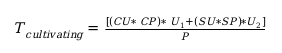

## Farming Token generation rules

### A Farmer earns tokens in 2 ways:

* **Farming Tokens:** as a result of connecting server hardware to the ThreeFold Grid

* **Cultivation Tokens:** as a result of their Farming Pool capacity being utilized by ThreeFold Grid Capacity users

### There are three types of capacity farmers:

* **Cooperative Farmers:** purchase a range of services from a ThreeFold cooperative up to and including, ThreeFold certified hardware, installation and -if available- location, power, and connectivity

* **Individual Farmers:** use ThreeFold certified hardware but complete their installation, provide their location, power and connectivity

* **DIY Farmers:** use their own choice of hardware (uncertified hardware)

### Three types of capacity:

* **Certified Capacity:** Underlying hardware is locked such that nobody (including the owner, farmer) can access and configure low-level BIOS and other features. It is a black box to the farmer and anyone that has physical access to the machine. The only control a farmer has over certified capacity is turning it on or off. It will, therefore, achieve a very level of security for consumers and will yield a higher certified capacity sales price (available in Q4 2019)

* **DIY Capacity:** The used hardware comes from unknown sources and is not restricted in terms of low-level access to BIOS and other configuration applications. This results in a less secure environment and a lower capacity price.

* **Managed Capacity:** TBD

### Farming Token generation rules until public Grid Capacity Utilization (Q4 2019):

There will be no distinction between certified and uncertified capacity

|   Capacity Type    | Farming TFTs   |
| ------------------ | ---------------|
| Certified | 1/60th of the calculated farming TFTs per month |
| DYI | 1/60th of the calculated farming TFTs per month |

### Farmer Token generation rules when Grid Capacity Utilization goes live (Q4 2019):
There will be differences between uncertified and certified capacity

|    Capacity Type   | Farming TFTs   |
| ------------------ | ---------------|
| Certified | 1/60th of the calculated farming TFTs per month |
| DIY| if (30% of capacity is reserved) then 1/60th of the calculated farming TFTs for that month |

**Note:** Once a node hits 30% capacity reservation within 6 months of the start of farming the past month and the one in which the 30% reservation has been met will be honored with 1/60 of the TFTs for each month. From then onwards the node needs to have a minimum of 30% capacity reservation to receive monthly tokens up until a total of 60 months.

**Note:** For both certified and DIY farming uptime guarantees apply in the form of SLA's that need to be met by Farmers.  Uptime guarantees are the result of several factors being done right - power, network, environment and actual health of the hardware.

### Farming TFT calculation

#### Farming TFT calculation formula (monthly)

* T = number of Tokens
* CU = Compute Units deployed
* SU = Storage Units deployed
* ACPT = Average Compute Unit price in Tokens at the time of connection (Avg Compute Unit price divided by Token price at connection)
* ASPT = Average Storage Unit price in Tokens at the time of connection (Avg Storage Unit price divided by Token price at connection)
* D = Difficulty level = 8

****DIY and certified capacity difficulty level: 8****
What does this mean: TFTs are undervalued by a factor of 8 (called difficulty level) during creation, i.e. if 100% of capacity is sold at connection time, then 8 times more TFTs would be required than have been issued. This mechanism allows the token to grow in value while remaining backed by the revenue potential of the TF Grid.

****Until public Grid Capacity Utilization (Q1 2020)****

To calculate the number of tokens farmed we use compute, and storage market pricing nubers. For so-called compute and storage units we take the average price in the market taking into account the highest and lowest price available.  These numbers will be periodically updated, at least once every year.

The current price levels are set to:

* Price for a compute unit (2 logical cores, 4GB of memory) = USD 15.00
* Price for a storage unit (1TB of archiving space) = USD 10.00

The token price currently sits at USD 0.12 with limited liquidity. Once liquidity is over a certain amount of traded tokens per day we will take the average actual token price as the token price for calculating the number of farmed tokens.  With these numbers ACPT and ASPT become:

* ACPT = $15.00 / $0.12 = 125
* ASPT = $10.00 / $0.12 = 83.3

[Compute and Storage Unit definition](https://github.com/threefoldfoundation/info_grid/blob/development/docs/concepts/cloud_units.md)

#### SLA requirements
For certified and DIY capacity there are Service Level Agreement (SLA) requirements.  These requirements are there to make sure that the presented capacity is usable and presents sufficient reliability for grid consumers to trust their compute and storage workloads to operate.

This table represents the initial numbers applicable to Threefold capacity farmers and ThreeFold network farmers.  These numbers may change going forward.

For capacity farming, we need to have a minimum uptime of the compute and storage capacity  to achieve.  This table represents the initial numbers applicable at launch time:

|  Capacity Farmer | Type | Europe | Africa | North America | Australia | Asia | South America |
| ---------------- | ---- | ------ | ------ | ------------- | --------- | ---- | ------------- |
| UPTIME SLA | DIY | 98% | 90% | 99% | 99% | 99% | 90% |
|     | Certified | 99.5% | 95% | 99.5% | 99.5% | 99.5% | 95% |

The network needs to comply with minimal uptime guarantees. This table represents the initial number applicable at launch time:

|  Capacity Farmer | Type | Europe | Africa | North America | Australia | Asia | South America |
| ---------------- | ---- | ------ | ------ | ------------- | --------- | ---- | ------------- |
| NETWORK SPEED SLA | DIY | NA | NA | NA | NA | NA | NA |
|                             |Certified | 5Mbps/TB | 1Mbps/TB | 5Mbps/TB | 5Mbps/TB | 5Mbps/TB | 1Mbps/TB |

### Cultivation TFT calculation

#### Cultivation TFT calculation formula (monthly)

* CU = Compute Units deployed
* SU = Storage Units deployed
* CP = Farmer’s Compute Unit price - expressed in Tokens
* SP = Farmer’s Storage Unit price - expressed in Tokens
* U1 = Compute Units Utilisation
* U2 = Storage Units Utilisation
* P = Token price at the time of capacity reservation

[Compute and Storage Unit definition](https://github.com/threefoldfoundation/info_grid/blob/development/docs/concepts/cloud_units.md)

****Will be applicable when public Grid Capacity Utilization goes live (Q1 2020)****

### Fees on Cultivation TFTs

There are two types of fees:
* 10% to ThreeFold Foundation for promoting the capacity on the grid
* 10% to TFTech License that keeps the TF Grid software components up to date and provides farmers support

|    Capacity Type   | TF Foundation   | TFTech|
| ------------------ | ---------------| ------------------ |
| Certified | 10% | 10% |
| DIY | 0% | 10% |

### Farming TFT release requirements

Farming pool uptime as defined at the time of registration on the TF Grid has to be met per period to get the farming tokens as defined under **Farming TFT calculation** section (see above)

Farming tokens are paid after the end of each period which represents a month that has the same number of days during the 60 months aka 5-year farming duration. This generic period is 30.44167 days which is 730.6 hours.

For the first period of farming the days online will be paid. Example: farming starts on the 8th day of period 1 of 60 periods (22.44167 = 30.44167 - 8) and is paid out in farming tokens. For the 60th period, 8 days are paid to complete the token payment for 60 periods which represents 5 years.

